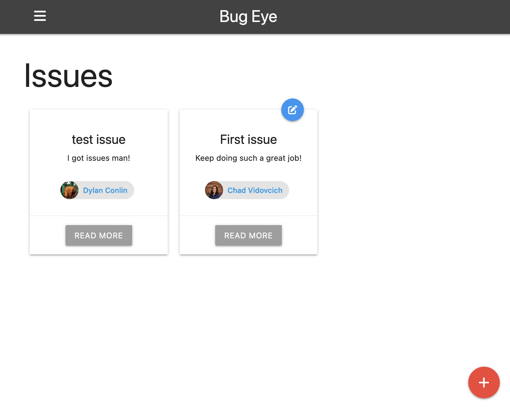

# Bug Eye

Keep track of those pesky issues.

Bug Eye is an issue tracking system. It allows users to organize, submit, and view issues.

Stack: MongoDB, Express, Handlebars, Node, Google OAuth

## Screenshots



## Tech Stack

Node.js, MongoDB, Express.js, React, Google OAuth 2.0

## Usage

View the live deployment here:

[Bug Eye Live Deployment](https://bugeye.chadvidovcich.com/)

## Run Locally

**Requirements before starting:**

- [MongoDB Atlas URI](https://www.mongodb.com/atlas/database)
- [Google Oauth2.0 ClientID and Secret](https://console.cloud.google.com)

Clone the project to your local environment

```bash
  git clone https://github.com/chadvidovcich/bug-eye.git
```

Go to the project directory

```bash
  cd bug-eye
```

Install dependencies

```bash
  npm install
```

Create environment variable file

```bash
  cd config
  touch config.env
```

Add the following entries to the environment variable file (config.env)

```bash
  # MongoDB Connection
  MONGO_URI = MONGODB-PLACEHOLDER-URI

  # Google OAuth 2.0 Connection
  GOOGLE_CLIENT_ID = GOOGLE-PLACEHOLDER-CLIENT-ID
  GOOGLE_CLIENT_SECRET = GOOGLE-PLACEHOLDER-CLIENT-SECRET
```

Start the server in production mode

```bash
  npm run start
```

## Authors

- [@ChadVidovcich](https://www.github.com/chadvidovcich)

## License

[MIT](https://choosealicense.com/licenses/mit/)

## Lessons Learned

My goal was to simulate a professional work environment.

    - I built a backend server using Express.
    - I integrated a database with my server using MongoDB.
    - I utilized Google OAuth 2.0 for user authentication.
    - I built a frontend client interface using React.
    - I wrote a clean and understandable readme with local installation instructions.
    - I used issues, feature branches and Pull Requests along the way to keep track of my progress.

I wanted to expand my technology knowledge by using new tools for this project.
